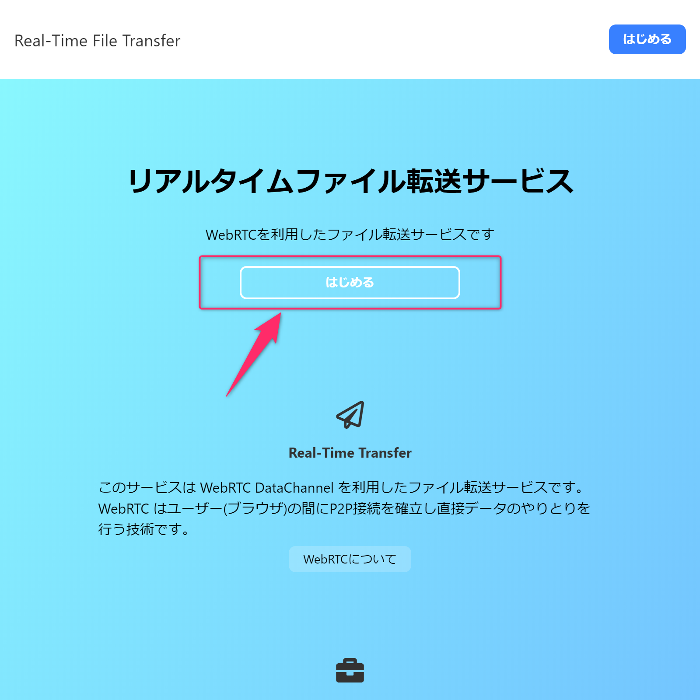
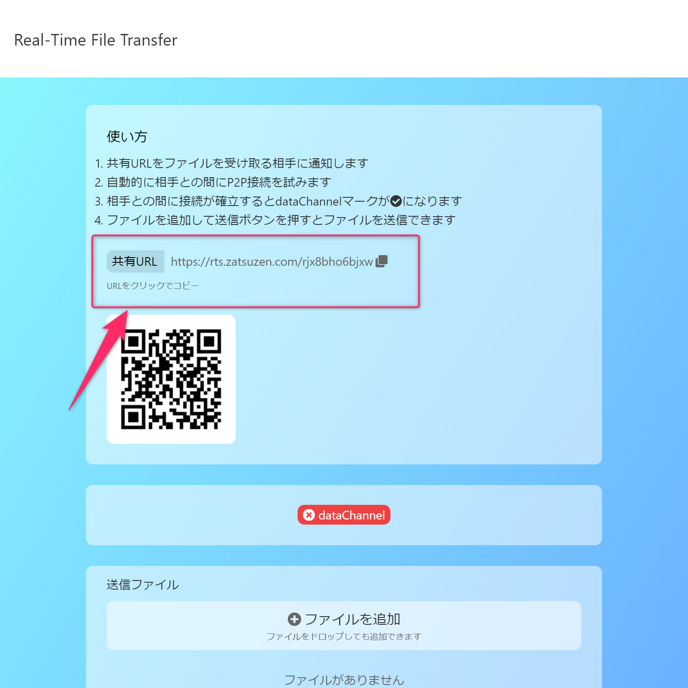

# ファイル転送サービスを作った

ブラウザ間でファイルのやりとりを行えるアプリを作りました。  
WebRTCのdataChannelを利用したブラウザ間でのファイルの双方交換ができます。

<a href='https://rts.zatsuzen.com' target='_blank'>Real-Time File Transfer</a>

## できること

ネットワークにつながったPC間でブラウザのみを使ってファイルのやりとりができます。  
WebRTCを使うことにより、インターネットやLAN内など、場所を問わず接続できます。

## 対応ブラウザ

現在 WebRTC DataChannel に対応しているブラウザはPC版の Chrome, Firefox, Opera, Safari です。
また、Android や iOS の Safari でも使えるはず(未確認)です。

## 使い方

使い方はとてもシンプルです。

1. トップページから「はじめる」をクリックします。

2. サーバからIDが発行されます。

> https\://rts.zatsuzen.com/ あなたのID が受信側のURLです。
> 共有URLをクリックするとクリップボードにコピーします。

3. 表示されている共有URLに他のPC/ブラウザからアクセスします。

これで自動的に接続が試されます。
接続がうまくいくと、dataChannelのラベルが赤から青に変わります。

一度接続されると、共有URLは無効になります。  
これ以降はブラウザ同士のみで通信が行われます。  
一方のブラウザを閉じると接続は終了します。  

3. ファイルを追加、もしくはブラウザへファイルをドラッグ & ドロップします。
4. 送信ボタンを押します。

これで相手側のブラウザからダウンロードできます。

相手側のページからも同様にファイルの追加と送信ができます。