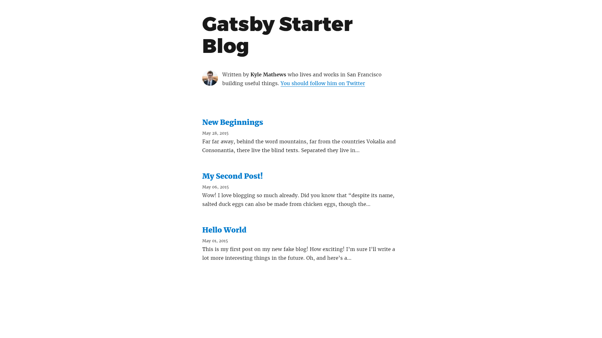

# Gatsbyとは
GatsbyはReactをベースにしていてとにかく爆速なのが売りのようです。
基本的なプロジェクトのStarterが用意されていて、機能を追加したいときはPluginを追加していく、という感じです。
やりたいことに対してPluginがないときはどうすればいいのでしょうか...。
自分で作るのかな？

Reactのみで作成したアプリケーション(SPA)では、SEOの観点から少し難があります。
head内のmetaタグを動的に変えるには<a href='https://github.com/nfl/react-helmet' target='_blank'>react-helmet</a>を使いますが、JavaScriptが実行される必要があり、ページアクセス時に取得されるHTMLには反映されず、正しくインデックスされるのか疑問です。  
Gatsbyでは公開前にbuildし各ページを生成しておくので、その辺もいい感じに対応してくれています。

### Gatsbyのメリット
- とにかく速い
- 外観が100%自由に作成できる
- ブラウザから編集できない
- ReactアプリよりSEOに強い気がする

### Gatsbyのデメリット
- 速すぎる
- フロントエンドの知識がいる気がする
- ビルドの流れがよくわからない
- CLIが使えないとだめ

# Gatsbyを使う

なにはともあれGatsbyを使うには`gatsby`コマンドが必要なので使えるようにします。

```shell
# npm i -g gatsby-cli
```

`-cli`をつけないとGatsby本体が来ちゃうので気を付けてください。

ブログのベースは<a href='https://github.com/gatsbyjs/gatsby-starter-blog' target='_blank'>gatsby-starter-blog</a>です。

```shell
// gatsby new [プロジェクト名] [ベースのダウンロード先]
# gatsby new blog-starter https://github.com/gatsbyjs/gatsby-starter-blog
```

`blog-starter`ディレクトリができるので、移動して`develop`コマンドでブラウザからアクセスできます。

```shell
# cd blog-starter
# gatsby develop
// http://localhost:8000
```

もし、ローカルLANからアクセスする場合は以下のオプションをつけます。

```shell
# gatsby develop -H 192.168.1.2 -p 8000
// http://192.168.1.2:8000
```



## プロジェクトディレクトリの構成

プロジェクトディレクトリの構成は以下のような感じになっています。

```shell
├─ content // コンテンツ置き場
│   ├─ assets // 画像ファイル
│   └─ blog // 記事ファイル
├─ gatsby-browser.js
├─ gatsby-config.js // プロジェクトの設定ファイル
├─ gatsby-node.js // developやbuildの時に実行される
├─ LICENSE
├─ node_modules
├─ package.json
├─ package-lock.json
├─ public
├─ README.md
├─ src // ページ構成のファイル
│   ├─ components
│   ├─ pages
│   ├─ templates
│   └─ utils
└─ static
    ├─ favicon.ico
    └─ robots.txt
```

`./content/blog`以下に置いたファイルが自動的にルーティングされます。

`gatsby develop`や`gatsby build`を行うと`./src`以下のファイルを読み込んで各ページが自動的に生成されます。

## デプロイ

Gatsbyプロジェクトのデプロイ方法はいくつかありますが、ここでは一般的なLinuxサーバで配信する場合の実行方法を紹介します。

デプロイには今回は<a href='http://pm2.keymetrics.io/' target='_blank'>pm2</a>を使います。
開発サーバとデプロイするサーバが別の場合には`gatsby-cli`もインストールします。
(Nodeアプリをデーモン化する方法は他にも<a href='https://github.com/foreverjs/forever' target='_blank'>forever</a>などがあります。)

```shell
# npm i -g pm2
```

プロジェクトディレクトリ内にpm2の設定ファイルを配置します。

```yml:title=<span>pm2config.yml</span>
name: blog
script: gatsby serve
```

json形式で`.json`ファイルにしても構いません。

以上で準備が整いました。

```shell
# gatsby build
# pm2 start pm2config.yml --name 'blog'
```

これで、デフォルトの設定であれば9000番ポートに公開されます。
Webサーバを別で立てている場合はプロキシを通してください。

記事を更新したい時は、`content`ディレクトリにコピーしてから`gatsby build`を実行すればOKです。