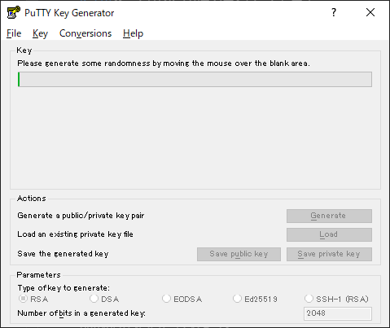

# Google Cloud Platform

WindowからSSHでPuTTYとかを使ってGCPのVMインスタンスに接続する方法です。

Google Cloudの<a href='https://cloud.google.com/compute/docs/instances/connecting-advanced#thirdpartytools?hl=ja' target='_blank'>公式ガイド</a>にも書いてあります。

<a href='https://www.chiark.greenend.org.uk/~sgtatham/putty/latest.html' target='_blank'>PuTTY</a>ページからPuTTYをダウンロードします。

SSH接続にはputty.exe、鍵の作成にはputtygen.exeを使用します。

## 公開SSH認証鍵の作成

puttygen.exeを使って公開SSH認証鍵を作成します。

puttygen.exeを立ち上げます。

ウィンドウ下部のParametersはだいたいデフォルトのままでOKです。

Number of bits in a generated key は 2048 以上にする必要があります。

[Generate]をクリックします。

> Please generate some randomness by mobing the mouse over the blank area.

ウィンドウ枠内でマウスカーソルを適当に動かすことでランダムな値を生成します。
以下の画面上で適当にマウスカーソルを動かします。

鍵の生成ができました。

Public key for pasting in to OpenSSH authorized keys file に表示されている文字列が公開鍵です。

Key comment に設定した文字列がインスタンスでのユーザー名になります。

Key passphrase も設定します。  
Confirm passphrase にも同様にパスフレーズを入力します。

File メニューから Public Key と Private Key を保存しておきます。

## 公開SSH認証鍵の登録

VMインスタンス詳細画面から登録します。

Google Cloud Platform のコンソールを開き、Compute EngineのVMインスタンスから、登録するインスタンスの詳細を開きます。

編集を開き、SSHキーの 項目を追加 から puttygen.exe で Public key for pasting in to OpenSSH authorized keys file の文字列をそのままコピー&ペーストします。

形式は`ssh-rsa [KEY_VALUE] [USERNAME]`です。

保存して完了。

## puttyで秘密鍵を使って接続する

putty.exe を立ち上げます。

Host Name にインスタンスの外部IPアドレスをそのまま入力します。

`[username]@[IP address]` の形式で入力してもOKです。

Connection → SSH → Auth を開き Private key file for authentication に puttygen.exe で作成した秘密鍵を登録します。

Sessionに戻り、Saved Sessionsに名前を入力して[Save]で設定を保存できます。

[Open]でインスタンスに接続できます。

接続したらputtygen.exeで入力したPassphraseを入力して接続完了です。