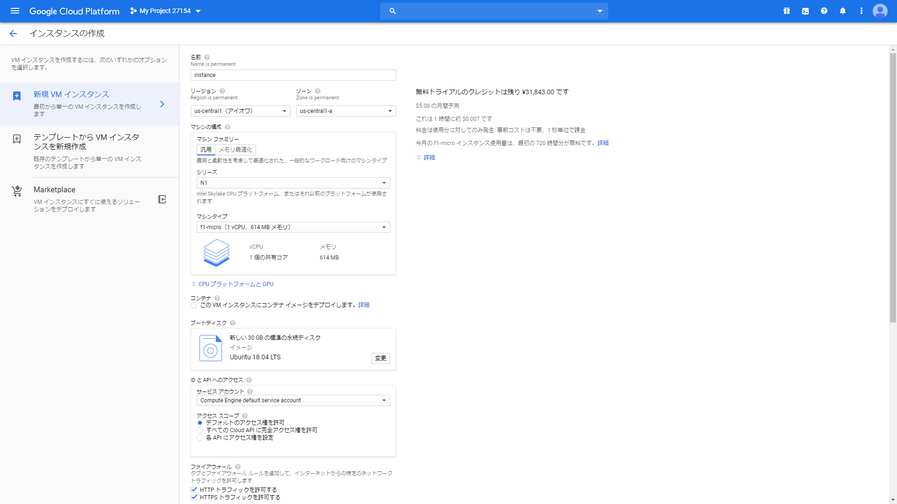

# Google Cloud Platform

GCPでサーバ立てられるらしいので、ちょっと触ってみた。AWSもそうだけど、いつどこで課金されるのかよくわからなくて敬遠してるんですよね...。でも触ってみた感じAWSよりもUIがわかりやすい気がしてきたので意を決していきます。

GCPはWebサイトなどでGoogle Map APIを使う以上触れないわけにはいかないみたいなサービスでしたが、他にもいろいろできすぎて全容が計り知れません。今日はCompute Engineを使ってみます。

よくわからないまま書く、よくわからない体験記なので、もし参考にされる方はご注意ください。

まず、インスタンスという言葉が全然慣れないんですが、サーバそのものというイメージで合ってるんでしょうか。

## アカウント登録

前提としてGoogleアカウントが必要です。そして<a href='https://cloud.google.com' target='_blank'>Google Cloud Platform</a>にアクセス。

無料トライアルをクリックします。

利用規約に目を通して、続行。
次の画面で住所やクレジットカード情報を入力します。

ここで入力する情報は本人確認のためで、すぐ課金されたりすることはないようです。

登録完了するとGCPのコンソール画面が表示されます。

## 新しいプロジェクトの作成

GCPではプロジェクト単位で管理するようです。

なにをするにも、まずはプロジェクトの作成が必要です。とりあえず適当に作ります。

プロジェクト名は後から変えられないようなので注意して決めます。

作成すると作成完了まで少し時間がかかります。

次にインスタンスを作成します。

## インスタンスの作成

メニューからCompute Engine → VM インスタンスを開きます。

開くと、Compute Engineを準備しています。というメッセージが出ます。初期化に時間がかかるようです。

### 名前

名前は後から変えられないようです。
サーバの名前にもなります。
慎重に決めます。

### リージョン

物理サーバがある場所を選びます。
無料枠はアメリカのみ有効になるみたいなので、アメリカ`us-*`を選択します。

日本からアクセスする予定の場合は距離を考えるといいのかも

### ゾーン

さらにリージョン内でどのサーバを使うか指定します。
たぶんそういうことだと思います。

たくさんサーバ(インスタンスか)を立てる場合はゾーンの設定も考えなきゃいけないんだと思います。

### マシンの構成

無料枠で利用するならシリーズはN1(第1世代)、マシンタイプはf1-micro(1 vCPU、614MB メモリ)を選択します。

#### CPUプラットフォームとGPU

リンクをクリックすると展開します。

##### CPUプラットフォーム

たぶん初期状態の自動のままでいいでしょう。

##### GPU

GPUが追加できます。

追加すると無料枠でもお金かかりそうです。

### コンテナ

このVMインスタンスにコンテナイメージをデプロイします。というチェックボックスがありますがチェックなし(初期状態)で。

### ブートディスク

初期状態はDebian GNU/Linux 9 (stretch)です。

変更を開いて変更します。

#### OSイメージ

無料枠ではOSイメージはLinux系を選びます。
私はUbuntu 18.04 LTSを選びました。

#### ブートディスクの種類

これは標準の永続ディスク(初期状態)を選びます。

#### サイズ

初期状態では10GBですが、無料枠で30GBまで使えるので30にしましょう。

### IDとAPIへのアクセス

サービスアカウントとアクセススコープ共に初期状態のまま。

### ファイアウォール

通常のウェブサーバを立てる場合はHTTPとHTTPSの両方にチェックを入れます。

#### 管理、セキュリティ、ディスク、ネットワーク、単一テナンシー

リンクをクリックすると展開します。

##### ネットワーキング

設定を変えるのはこの項目のみ。

##### ネットワークインターフェース

ここで、外部IPが初期状態ではエフェメラルになっています。
エフェメラルはIPがころころ変わって面倒なので固定IPにします。

IPアドレスを作成を選択します。

モーダルウィンドウが出てきて静的IPアドレスの予約ができます。

ここでも名前は後から変えられないようです。

適当な名前を設定します。

ネットワークサービス階層は標準を選択します。

予約を押すと自動的に作成、設定されます。

完了を押してネットワークインターフェースの設定を閉じます。

## 作成完了

作成を押すと数分でインスタンスが作成され自動的に起動します。

## 外部IPアドレスについて

インスタンス作成中にネットワーク設定で外部IPアドレスを作成しますが、インスタンスなどで使用していない場合は有料となるようです。

Google Cloud PlatformのメニューからVPCネットワーク → 外部IPアドレスを開きます。ここで不要な外部IPアドレスの確認および削除ができます。

外部IPアドレスをリストから選択して 静的アドレスを解放 で削除できます。

## SSH接続

VMインスタンスの詳細画面からリモートアクセスできます。

ブラウザウィンドウで開く が一番手っ取り早いと思います。