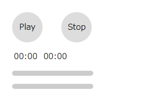
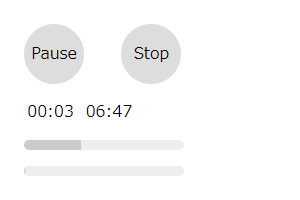

# audioファイルの読み込み量を取得する

[前回](../audio-seekbar)、シークバーを追加する方法を紹介しました。

今回は、そのシークバーでオーディオファイルの読み込み状況がわかるようにします。

## 読み込み量を表示

Webでオーディオを扱うときは、使うmp3ファイルは必ずしもローカルにあるわけではなく、同じくWebから取得すると思います。  
当然ダウンロードには時間がかかるので、再生ボタンを押してから無反応になってしまうとUXは低下してしまいます。  

読み込み量は`onprogress`イベントが発生しているときに`buffered`属性から`TimeRanges`オブジェクト形式として取得できます。

### HTMLの追加

新しく`#loading`要素を追加します。

```html:title=<span>HTML</span>
<div id="loading"></div>
```

### CSSの追加

`#loading`は`#seekbar`とCSSを共有しています。  
参考: [前回](../audio-seekbar)

```css{1}:title=<span>CSS</span>
#seekbar, #loading {
  width: 160px;
  height: 10px;
  margin: 1em;
  border-radius: 5px;
  background: linear-gradient(#ccc, #ccc) no-repeat #eee;
}
```



こんな感じ。
`background-color`を透過させてシークバーと読み込みプログレスバーを重ねてもいいですね。

### JavaScriptの追加

audio.onprogressに直接追加します。

```javascript:title=<span>JavaScript</span>
audio.onprogress = function () {
  if(audio.buffered.length > 0){
    const percent = Math.round((audio.buffered.end(audio.buffered.length-1)/audio.duration)*1000)/10
    document.getElementById('loading').style.backgroundSize = percent + '%'
  }
}
```

これで読み込みの状況も確認できるようになりました。



`<audio>`タグはストリーミング再生なので、完全にダウンロードされてから再生されるのではなく、再生速度をみながら、ここまで読み込めばあとは再生中にダウンロードできると判断した時点から再生開始されます。

そのへんはブラウザがいい感じにやってくれます。

ちなみにそのときは`oncanplaythrough`などのイベントが発火します。

## まとめ

最後にここまでをひとつにまとめたものです。
長くなってきちゃいましたね。

```html:title=<span>index.html</span>
<html>
<head>
  <title>HTML5のAudioタグテスト</title>
  <style>
    audio {
      display: none
    }
    #play, #stop {
      display: inline-block;
      width: 60px;
      height: 60px;
      margin: 1em;
      border-radius: 50%;
      background: #ddd;
      text-align: center;
      line-height: 60px;
      cursor: pointer;
    }
    #play:hover, #stop:hover {
      background: #eee;
    }
    #time {
      margin: 0 1em;
    }
    #current, #duration {
      padding: 0;
      margin: .2em;
    }
    #seekbar, #loading {
      width: 160px;
      height: 10px;
      margin: 1em;
      border-radius: 5px;
      background: linear-gradient(#ccc, #ccc) no-repeat #eee;
    }
  </style>
</head>
<body>
  <div>
    <audio src="sample.mp3"></audio>
    <div id="play">Play</div>
    <div id="stop">Stop</div>
    <div id="time">
      <span id="current">00:00</span>
      <span id="duration">00:00</span>
    </div>
    <div id="loading"></div>
    <div id="seekbar"></div>
  </div>
  <script>
    const audio = document.getElementsByTagName("audio")[0]
    const playButton = document.getElementById("play")
    const stopButton = document.getElementById("stop")
    playButton.addEventListener('click', () => {
      if (audio.paused) {
        audio.play()
        play.innerHTML = play.innerHTML === 'Play' ? 'Pause' : 'Play'
      } else {
        audio.pause()
        play.innerHTML = 'Play'
      }
    })
    stopButton.addEventListener('click', () => {
      audio.pause()
      audio.currentTime = 0
    })
    audio.onprogress = function () {
      if(audio.buffered.length > 0){
        const percent = Math.round((audio.buffered.end(audio.buffered.length-1)/audio.duration)*1000)/10
        document.getElementById('loading').style.backgroundSize = percent + '%'
      }
    }
    audio.addEventListener("timeupdate", (e) => {
      const current = Math.floor(audio.currentTime)
      const duration = Math.round(audio.duration)
      if(!isNaN(duration)){
        document.getElementById('current').innerHTML = playTime(current)
        document.getElementById('duration').innerHTML = playTime(duration)
        const percent = Math.round((audio.currentTime/audio.duration)*1000)/10
        document.getElementById('seekbar').style.backgroundSize = percent + '%'
      }
    })
    document.getElementById('seekbar').addEventListener("click", (e) => {
      const duration = Math.round(audio.duration)
      if(!isNaN(duration)){
        const mouse = e.pageX
        const element = document.getElementById('seekbar')
        const rect = element.getBoundingClientRect()
        const position = rect.left + window.pageXOffset
        const offset = mouse - position
        const width = rect.right - rect.left
        audio.currentTime = Math.round(duration * (offset / width))
      }
    })
    function playTime (t) {
      let hms = ''
      const h = t / 3600 | 0
      const m = t % 3600 / 60 | 0
      const s = t % 60
      const z2 = (v) => {
        const s = '00' + v
        return s.substr(s.length - 2, 2)
      }
      if(h != 0){
        hms = h + ':' + z2(m) + ':' + z2(s)
      }else if(m != 0){
        hms = z2(m) + ':' + z2(s)
      }else{
        hms = '00:' + z2(s)
      }
      return hms
    }
  </script>
</body>
</html>
```

とりあえずオーディオプレイヤーを作るシリーズはこれでいったん終わりにします。

HTMLMediaElementの属性やメソッドはMDNのまとめが参考になります。

参考: <a href='https://developer.mozilla.org/ja/docs/Web/API/HTMLMediaElement' target='_blank'>HTMLMediaElement | MDN</a>

なにかご意見などありましたらTwitterまでお願いいたします。
