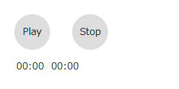

# オリジナルオーディオプレイヤー

[前回](../audio-tag)はオーディオを再生、一時停止するところまで作りました。
次はプレイヤーっぽくしましょう。

## 再生時間の表示

オーディオを再生するのであれば時間の表示は欲しいですよね。
時間を表示する要素を追加します。
HTMLは好きな場所に追加してください。
必要なのは`id`属性だけです。

### HTMLの追加

```html:title=<span>HTML</span>
<div id="time">
  <span id="current">00:00</span>
  <span id="duration">00:00</span>
</div>
```

### CSSの追加

```css:title=<span>CSS</span>
#time {
  margin: 0 1em;
}
#current, #duration {
  padding: 0;
  margin: .2em;
}
```

はい！できました。
左側が現在の時間で右側が全体の再生時間です。



### JavaScriptの編集

これをJavaScriptでaudioタグから情報をもらって更新します。
現在時刻と再生時間は`audio.currentTime`と`audio.duration`で取得できますが、そのタイミングのデータしか得られません。audio再生中は`timeupdate`イベントが起こるのでそれを拾ってそれぞれ取得・更新します。

`duration`はたまに`null`になったりするので数字かどうかを確認します。

```javascript:title=<span>JavaScript</span>
const audio = document.getElementsByTagName("audio")[0]

audio.addEventListener("timeupdate", (e) => {
  const current = Math.floor(audio.currentTime)
  const duration = Math.round(audio.duration)
  if (!isNaN(duration)) {
    document.getElementById('current').innerHTML = current
    document.getElementById('duration').innerHTML = duration
  }
})
```

1秒間に4回くらい`timeupdate`が走ります。

### 再生時間表示用関数

`audio`から取得できる時間データは秒ですので、`mm:ss`形式に直す関数を用意します。

```javascript{24-25}:title=<span>JavaScript</span>
function playTime (t) {
  let hms = ''
  const h = t / 3600 | 0
  const m = t % 3600 / 60 | 0
  const s = t % 60
  const z2 = (v) => {
    const s = '00' + v
    return s.substr(s.length - 2, 2)
  }
  if(h != 0){
    hms = h + ':' + z2(m) + ':' + z2(s)
  }else if(m != 0){
    hms = z2(m) + ':' + z2(s)
  }else{
    hms = '00:' + z2(s)
  }
  return hms
}

audio.addEventListener("timeupdate", (e) => {
  const current = Math.floor(audio.currentTime)
  const duration = Math.round(audio.duration)
  if (!isNaN(duration)) {
    document.getElementById('current').innerHTML = playTime(current)
    document.getElementById('duration').innerHTML = playTime(duration)
  }
})
```

## 再生ボタンの機能変更

[前回](../audio)作ったコントローラは再生と停止(一時停止)ボタンを別にしていましたが、それらを1つのボタンにまとめ、停止ボタンは停止と曲頭に戻るようにします。

再生ボタンが押されたときに、audioが再生しているかをみて再生中であれば一時停止、一時停止中であれば再生します。ついでに再生ボタンの文字も変えます。
また、停止ボタンを押すと曲の頭に戻ります。

```javascript:title=<span>JavaScript</span>
const audio = document.getElementsByTagName("audio")[0]
const playButton = document.getElementById("play")
const stopButton = document.getElementById("stop")

playButton.addEventListener('click', () => {
  if (audio.paused) {
    audio.play()
    play.innerHTML = play.innerHTML === 'Play' ? 'Pause' : 'Play'
  } else {
    audio.pause()
    play.innerHTML = 'Play'
  }
})

stopButton.addEventListener('click', () => {
  audio.pause()
  audio.currentTime = 0
})
```

## まとめ

オーディオ再生に加え、再生時間の表示ができました。

次はシークバーを追加したいと思います。

ここまでをひとつのHTMLにまとめるとこんな感じ。

```html:title=<span>index.html</span>
<html>
<head>
  <title>HTML5のAudioタグテスト</title>
  <style>
    audio {
      display: none
    }
    #play, #stop {
      display: inline-block;
      width: 60px;
      height: 60px;
      margin: 1em;
      border-radius: 50%;
      background: #ddd;
      text-align: center;
      line-height: 60px;
      cursor: pointer;
    }
    #play:hover, #stop:hover {
      background: #eee;
    }
    #time {
      margin: 0 1em;
    }
    #current, #duration {
      padding: 0;
      margin: .2em;
    }
  </style>
</head>
<body>
  <div>
    <audio src="sample.mp3"></audio>
    <div id="play">Play</div>
    <div id="stop">Stop</div>
    <div id="time">
      <span id="current">00:00</span>
      <span id="duration">00:00</span>
    </div>
  </div>
  <script>
    const audio = document.getElementsByTagName("audio")[0]
    const playButton = document.getElementById("play")
    const stopButton = document.getElementById("stop")
    playButton.addEventListener('click', () => {
      if (audio.paused) {
        audio.play()
        play.innerHTML = play.innerHTML === 'Play' ? 'Pause' : 'Play'
      } else {
        audio.pause()
        play.innerHTML = 'Play'
      }
    })
    stopButton.addEventListener('click', () => {
      audio.pause()
      audio.currentTime = 0
    })

    audio.addEventListener("timeupdate", (e) => {
      const current = Math.floor(audio.currentTime)
      const duration = Math.round(audio.duration)
      if(!isNaN(duration)){
        document.getElementById('current').innerHTML = playTime(current)
        document.getElementById('duration').innerHTML = playTime(duration)
      }
    })

    function playTime (t) {
      let hms = ''
      const h = t / 3600 | 0
      const m = t % 3600 / 60 | 0
      const s = t % 60
      const z2 = (v) => {
        const s = '00' + v
        return s.substr(s.length - 2, 2)
      }
      if(h != 0){
        hms = h + ':' + z2(m) + ':' + z2(s)
      }else if(m != 0){
        hms = z2(m) + ':' + z2(s)
      }else{
        hms = '00:' + z2(s)
      }
      return hms
    }
  </script>
</body>
</html>
```