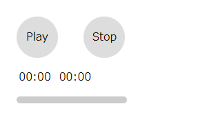
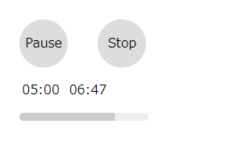

# シークバーを作る

[前回](../audio-player)までは再生・停止ボタンと再生時間の表示を作りました。

## シークバーとは

シークバーは、再生中の楽曲のどの部分なのかを表示するUIで、操作することで再生時間の変更ができる機能のことです。


これを追加します。

### HTMLの追加

`#seekbar`という要素を追加します。

```html:title=<span>HTML</span>
<div id="seekbar"></div>
```

### CSSの追加

```css:title=<span>CSS</span>
#seekbar {
  width: 160px;
  height: 10px;
  margin: 1em;
  border-radius: 5px;
  background: linear-gradient(#ccc, #ccc) no-repeat #eee;
}
```

こんな感じ。
とりあえず再生時間の下に追加しました。



このままだとしょぼいので、ちゃんとプレイヤーを作るときはCSSでうまく作ってください！笑

### JavaScriptを編集

`timeupdate`のイベントに以下の2行を追加します。

```javascript{9,10}:title=<span>JavaScript</span>
const audio = document.getElementsByTagName("audio")[0]

audio.addEventListener("timeupdate", (e) => {
  const current = Math.floor(audio.currentTime)
  const duration = Math.round(audio.duration)
  if (!isNaN(duration)) {
    document.getElementById('current').innerHTML = current
    document.getElementById('duration').innerHTML = duration
    const percent = Math.round((audio.currentTime/audio.duration)*1000)/10
    document.getElementById('seekbar').style.backgroundSize = percent + '%'
  }
})
```

## このシークバーの仕組み
CSSの`background: linear-gradient(#ccc, #ccc) no-repeat #eee;`がポイントです。
`background-image`に`linear-gradient`が指定され、`background-color`に`#eee`が指定されています。
`background-size`はCSSからは指定しません。
`background-size`は`background-image`の幅を変更できますので、これをJavaScriptから変更することで、再生位置を表示します。

参考: <a href='https://developer.mozilla.org/ja/docs/Web/CSS/background-size' target='_blank'>background-size | MDN</a>

## 再生位置の移動

通常のシークバーはシークという名の通り再生位置を変更できます。

シークバーをクリックした位置を取得してそこから再生時間を計算します。

```javascript:title=<span>JavaScript</span>
document.getElementById('seekbar').addEventListener("click", (e) => {
  const duration = Math.round(audio.duration)
  if(!isNaN(duration)){
    const mouse = e.pageX
    const element = document.getElementById('seekbar')
    const rect = element.getBoundingClientRect()
    const position = rect.left + window.pageXOffset
    const offset = mouse - position
    const width = rect.right - rect.left
    audio.currentTime = Math.round(duration * (offset / width))
  }
})
```

要素がクリックされたときにクリックされた座標と要素のサイズから割合を出します。
`currentTime`属性に代入することでシークすることができます。

## まとめ

だいぶプレイヤーっぽくなってきました。



最後にここまでをひとつにまとめたものです。

```html:title=<span>index.html</span>
<html>
<head>
  <title>HTML5のAudioタグテスト</title>
  <style>
    audio {
      display: none
    }
    #play, #stop {
      display: inline-block;
      width: 60px;
      height: 60px;
      margin: 1em;
      border-radius: 50%;
      background: #ddd;
      text-align: center;
      line-height: 60px;
      cursor: pointer;
    }
    #play:hover, #stop:hover {
      background: #eee;
    }
    #time {
      margin: 0 1em;
    }
    #current, #duration {
      padding: 0;
      margin: .2em;
    }
    #seekbar {
      width: 160px;
      height: 10px;
      margin: 1em;
      border-radius: 5px;
      background: linear-gradient(#ccc, #ccc) no-repeat #eee;
    }
  </style>
</head>
<body>
  <div>
    <audio src="sample.mp3"></audio>
    <div id="play">Play</div>
    <div id="stop">Stop</div>
    <div id="time">
      <span id="current">00:00</span>
      <span id="duration">00:00</span>
    </div>
    <div id="seekbar"></div>
  </div>
  <script>
    const audio = document.getElementsByTagName("audio")[0]
    const playButton = document.getElementById("play")
    const stopButton = document.getElementById("stop")
    playButton.addEventListener('click', () => {
      if (audio.paused) {
        audio.play()
        play.innerHTML = play.innerHTML === 'Play' ? 'Pause' : 'Play'
      } else {
        audio.pause()
        play.innerHTML = 'Play'
      }
    })
    stopButton.addEventListener('click', () => {
      audio.pause()
      audio.currentTime = 0
    })

    audio.addEventListener("timeupdate", (e) => {
      const current = Math.floor(audio.currentTime)
      const duration = Math.round(audio.duration)
      if(!isNaN(duration)){
        document.getElementById('current').innerHTML = playTime(current)
        document.getElementById('duration').innerHTML = playTime(duration)
        const percent = Math.round((audio.currentTime/audio.duration)*1000)/10
        document.getElementById('seekbar').style.backgroundSize = percent + '%'
      }
    })

    document.getElementById('seekbar').addEventListener("click", (e) => {
      const duration = Math.round(audio.duration)
      if(!isNaN(duration)){
        const mouse = e.pageX
        const element = document.getElementById('seekbar')
        const rect = element.getBoundingClientRect()
        const position = rect.left + window.pageXOffset
        const offset = mouse - position
        const width = rect.right - rect.left
        audio.currentTime = Math.round(duration * (offset / width))
      }
    })

    function playTime (t) {
      let hms = ''
      const h = t / 3600 | 0
      const m = t % 3600 / 60 | 0
      const s = t % 60
      const z2 = (v) => {
        const s = '00' + v
        return s.substr(s.length - 2, 2)
      }
      if(h != 0){
        hms = h + ':' + z2(m) + ':' + z2(s)
      }else if(m != 0){
        hms = z2(m) + ':' + z2(s)
      }else{
        hms = '00:' + z2(s)
      }
      return hms
    }
  </script>
</body>
</html>
```