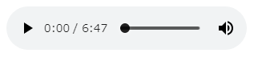
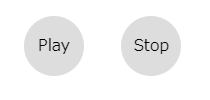

# Webでオーディオ再生

ホームページ上で音楽を流す方法はいくつかあります。

最も手っ取り早いのはHTML5で追加された`audio`タグを使う方法です。
これにはブラウザ標準のコントローラが使えるのでとても手軽です。

HTMLに`audio`タグを書くだけ。

```html:title=<span>HTML</span>
<audio src="sample.mp3" controls></audio>
```

Google Chrome 71ではこのようになります。



めちゃくちゃ簡単です。

しかし、標準コントローラはブラウザごとにUIが異なるのでホームページでデザインを統一したい時などに厄介です。
例えば、Edgeのコントローラはこんな感じ。


サイズも結構違って、Chromeは 300 x 54、Edgeは 300 x 30 です。

単純に音楽を流したいだけならこの方法が最も手軽です。

参考: <a href='https://developer.mozilla.org/ja/docs/Web/HTML/Element/audio' target='_blank'>&lt;audio&gt;: 埋め込み音声要素 | MDN</a>

> WebでAudioを扱うもうひとつの方法はWeb Audio APIを使います。こちらは改めて書こうと思います。

## オリジナルコントローラを作る

とりあえず、ブラウザ標準のコントローラが気に入らないので、オリジナルのものを作成しましょう。

`audio`タグでコントローラを使わずに操作するにはJavaScriptを使う必要があります。
要素の`onClick`を元にJavaScriptを介して`audio`タグを操作します。

### HTMLを編集

全体を`div`で囲ってコントローラのボタンとなる要素を追加します。
`div`をボタンにしてますが、別になんの要素でも構いません。

```html:title=<span>HTML</span>
<div>
  <audio src="sample.mp3"></audio>
  <div id="play">Play</div>
  <div id="stop">Stop</div>
</div>
```

### CSSを追加

`div`要素をボタンっぽくします。
`audio`タグに`controls`を書かなければだいたいコントローラは消えますが念のためCSSでも消します。

```css:title=<span>CSS</span>
audio {
  display: none
}
#play, #stop {
  display: inline-block;
  width: 60px;
  height: 60px;
  margin: 1em;
  border-radius: 50%;
  background: #ddd;
  text-align: center;
  line-height: 60px;
  cursor: pointer;
}
#play:hover, #stop:hover {
  background: #eee;
}
```

再生ボタン用にアイコンを作ったり、<a href='https://fontawesome.com' target='_blank'>Font Awesome</a>などを使うのも良いですね。  
今回は適当プレイヤーなのでダイレクトにPlayと書きます笑



### JavaScriptを追加

JavaScriptで要素のクリックから`audio.play()`を呼び出せば良いだけです。

```javascript:title=<span>JavaScript</span>
const audio = document.getElementsByTagName("audio")[0]
const playButton = document.getElementById("play")
const stopButton = document.getElementById("stop")

playButton.addEventListener('click', () => {
  audio.play()
})

stopButton.addEventListener('click', () => {
  audio.pause()
})
```
<!-- 
要素に`onclick="play()"`を追加して直接関数を呼び出してもいいです。
要するに要素をクリックすることで呼び出せればいいです。
JavaScriptにはいろいろな書き方があって、どれもあまり変わらないのでお気に入りの書き方で書くのがいいです。 -->

<!-- ```javascript:title=<span>JavaScript</span>
playButton.onclick = () => {
  audio.play()
}
``` -->

## まとめ

これで要素からaudioタグを操作し、音楽を再生・停止(一時停止)することができます。
オリジナルのコントローラはこれだけでは機能不十分ですのでさらに追加していきます。

ここまでをひとつのHTMLにまとめるとこんな感じ。

```html:title=<span>index.html</span>
<html>
<head>
  <title>HTML5のAudioタグテスト</title>
  <style>
    audio {
      display: none
    }
    #play, #stop {
      display: inline-block;
      width: 60px;
      height: 60px;
      margin: 1em;
      border-radius: 50%;
      background: #ddd;
      text-align: center;
      line-height: 60px;
      cursor: pointer;
    }
    #play:hover, #stop:hover {
      background: #eee;
    }
  </style>
</head>
<body>
  <div>
    <audio src="sample.mp3"></audio>
    <div id="play">Play</div>
    <div id="stop">Stop</div>
  </div>
  <script>
    const audio = document.getElementsByTagName("audio")[0]
    const playButton = document.getElementById("play")
    const stopButton = document.getElementById("stop")
    playButton.addEventListener('click', () => {
      audio.play()
    })
    stopButton.addEventListener('click', () => {
      audio.pause()
    })
  </script>
</body>
</html>
```

初めての技術解説(？)投稿ですが、どこまで詳しく書くのかしっかり決めてから書き始めないとだめですね。
ちょっと細かく書きすぎたので次はもうちょっと適当に書きます。