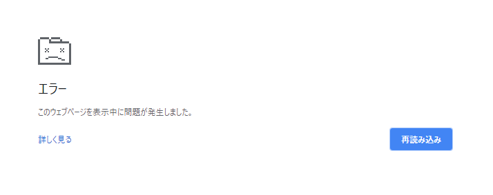
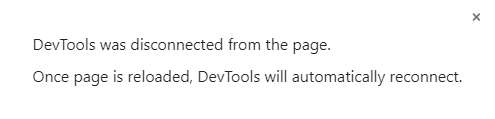

# Blobを使うとChromeがエラーになる

5MB程度のファイルを`Blob`を使ってChromeからファイルとして出力しようと思ったが、Chromeがクラッシュしてしまい、うまくいかない。




というか小さなサイズのファイルでも正しい形式にならない。

データをUint8Array型からファイルに変換するときの失敗例

```javascript:title=<span>JavaScript</span>
const data = new Uint8Array(fileObject)
const blob = new Blob(data, {type: 'text/plain'})
```

## 配列でないとダメ

Uint8Array型は配列だと思ってたのですが、さらに配列に入れてやらないとダメらしい。

`[]`で囲むだけでうまくいきました。

```javascript:title=<span>JavaScript</span>
const blob = new Blob([data], {type: 'text/plain'})
```

## ファイルのダウンロード

ちなみに、これをブラウザからダウンロードさせるときは、以下のようにして、URLを作成します。

```javascript:title=<span>JavaScript</span>
const url = window.URL.createObjectURL(blob)
```

これを`<a>`タグの`href`に指定してあげればOK。

ていうかよく見たらMDNにちゃんと書いてあった。

<a href='https://developer.mozilla.org/ja/docs/Web/API/Blob' target='_blank'>Blob | MDN</a>