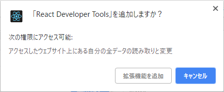

# Reactとは

ReactはJavaScriptのフレームワークのひとつで、もともとはFacebookで利用するためにFacebookが開発したものです。
最近ではjQueryに代わるフレームワークとして注目を集め、Reactに置き換えるWebサイトも多くあります。

Reactはいまでは様々なホームページで使われていますが、見ただけではわかりません。

今回はホームページにReactが使われているか確認する方法を紹介します。

## Reactが使われているか確認する

### React Developer ToolsをChrome拡張に追加する

WebサイトにReactが使われているか確認するにはChromeにReact Developer Toolsを追加します。

<a href='https://chrome.google.com/webstore/detail/react-developer-tools/fmkadmapgofadopljbjfkapdkoienihi?hl=ja' target='_blank'>React Developer Tools - Chrome ウェブストア</a>


「Chromeに追加」をクリックします。



「拡張機能を追加」をクリックします。

これだけ。

アドレスバーの横にアイコンが追加されます。


### 表示されるアイコンの種類

Reactが使用されているページは以下のアイコン。


- This page is using the production build of React.

---

使われていないページだとグレーアウトします。


- This page doesn't appear to be using React.

---

Reactには`develop build`と`production build`があって、developの状態だとこのアイコンになります。


- This page is using the development build of React.

---

古いバージョンのReactを使っているサイトは以下のアイコンになります。 


- This page is using an outdated version of React.

---

## React Developer Toolsについて

React Developer Toolsは、もともとReactの開発補助のためのChrome拡張機能です。

Reactの開発に便利なStateやコンポーネントの状態の確認などができ、かなり高機能な拡張機能です。

### Development Build と Production Build

Development Buildのままだとmapファイルが作成され、セキュリティも弱くなるので、デプロイするときはかならずProduction Buildにしましょう。

#### Create React App

`Create React App`を使用しているプロジェクトは以下のコマンドを使用します。

```shell:title=<span>shell</span>
# npm run build
```

#### webpack

`webpack`を使用してbuildする場合は設定ファイルで`mode: 'production'`を指定しましょう。

```javascript:title=<span>webpack.js</span>
module.exports = {
  mode: 'production'
}
```

参考: <a href='https://github.com/facebook/react-devtools/blob/master/README.md#the-react-tab-doesnt-show-up' target='_blank'>react-devtools | GitHub</a>
