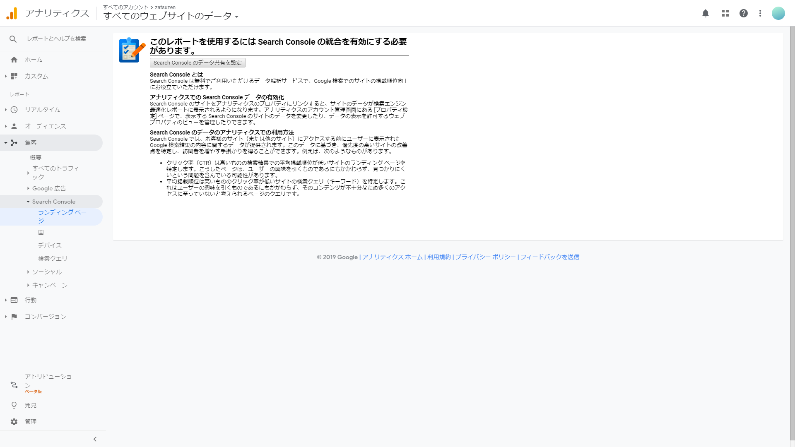
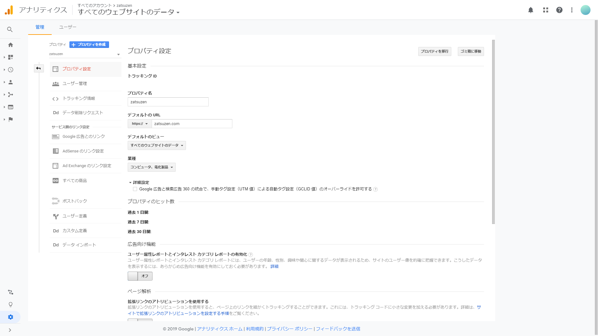
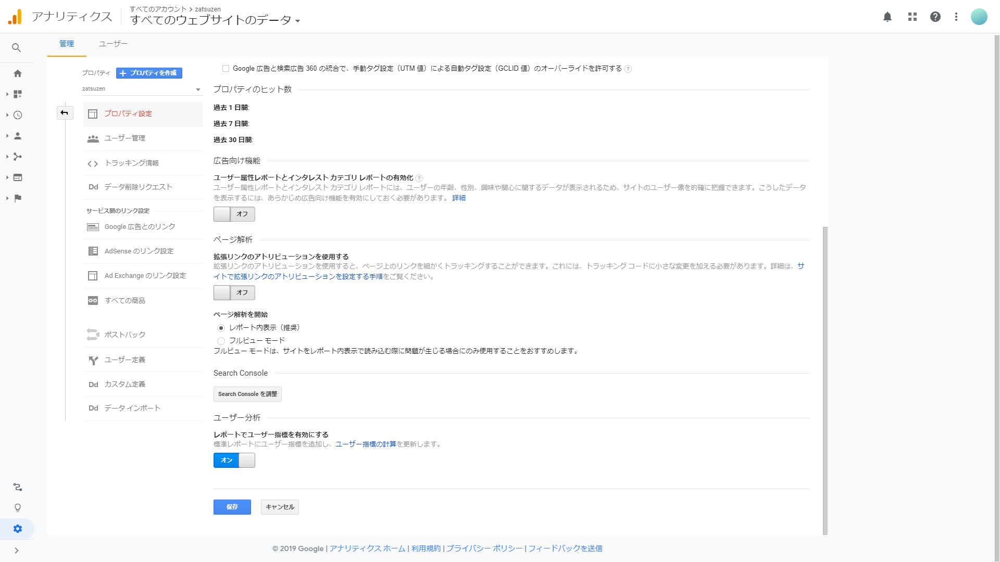
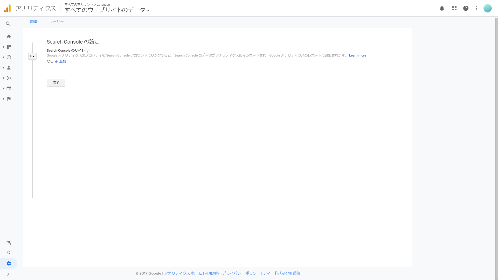
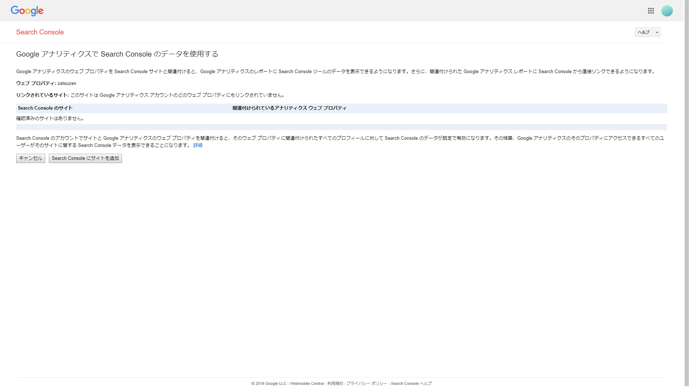
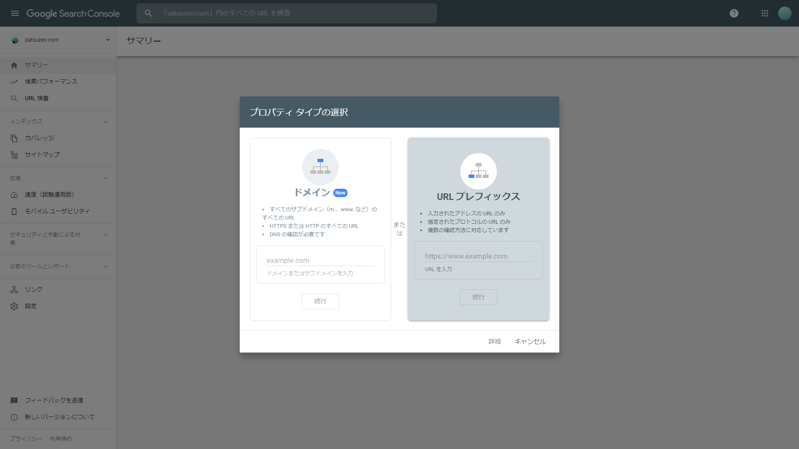
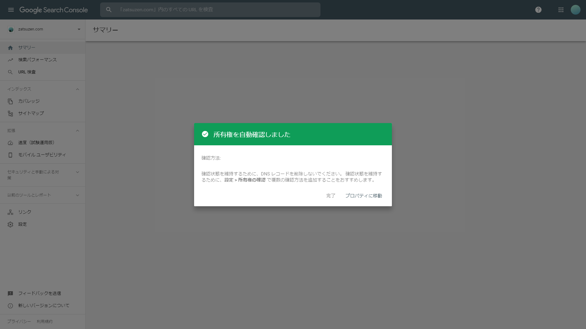
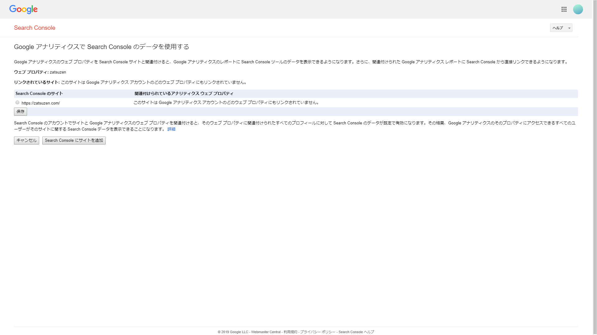

# GA と SC の連携でつまづいた

Google Analytics と Search Console の連携時にずっとよくわからないまま放置してたけどやっと原因がわかった。

Search Consoleにページを追加しているのに、 Google アナリティクスで Search Console のデータを使用する ページで "確認済みのサイトはありません。" と表示されるのはSearch Consoleにドメインプロパティで追加しているためです。
プロパティの追加をURLプレフィックスで行うとGoogle アナリティクス側に表示されます。

# Google Analytics

Googleアナリティクスの 集客 メニューから Search Console を開くと、ユーザーがどういった検索クエリで、どんなデバイスでページを見ているか調べることができます。

この機能はSearch Consoleとの連携が必要です。

Search Console のデータ共有を設定をクリック。

プロパティの設定が開くので、Search Console の Search Console を調整 をクリック。

Search Consoleの設定ページが開きます。

追加 をクリック。

Search Consoleで追加したページ一覧が表示されます。

ここで Search Console のサイト が 確認済みのサイトはありません。 と表示される場合は 下の Search Console にサイトを追加 をクリックします。

あらかじめ Search Console にページを追加していても、ドメインプロパティで設定した場合はここには表示されません。

Search Console のページへとびます。

左上のメニューから プロパティを追加 でモーダルウィンドウが開きます。

URLプレフィックスを選択してGoogle Analyticsを使用しているページのフルURLを入力します。

追加完了しました。

Google Analytics の先ほどの画面を更新すると表示されます。

保存 で登録完了です。

Search Console にページを追加した直後はすぐにデータが反映されないので気を付けてください。

以上です。